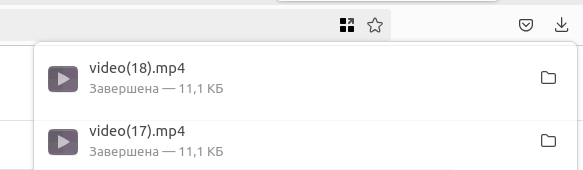
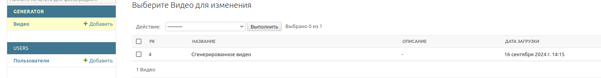

### Приложение для генерации видео бегущей строки в формате mp4 и сохранением в базу данных
* Использованы библиотеки moviepy, django, DRF
* Метод генерации написан с помощью ViewSet
* Оформление сайта bootstrap
* БД postgres

